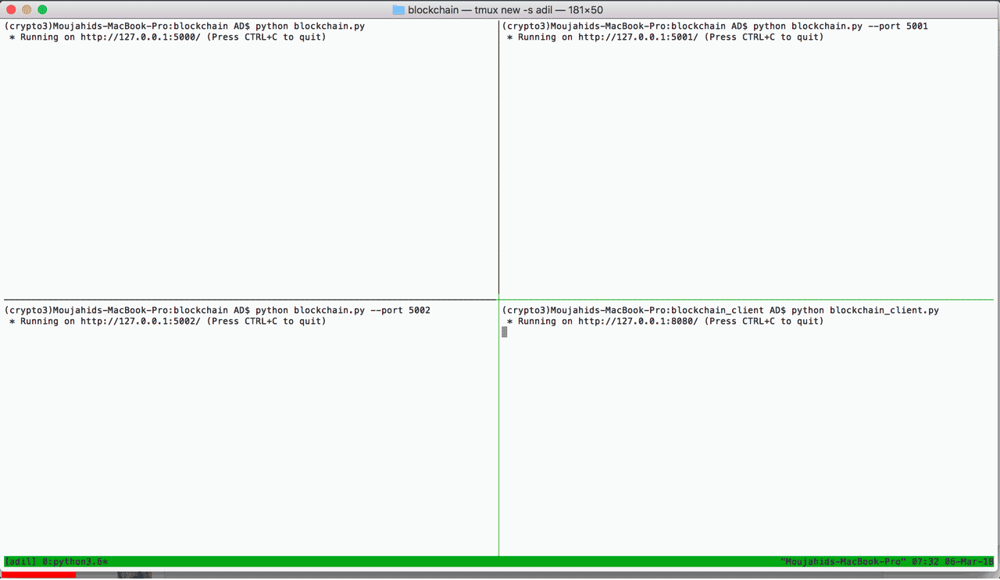

# Blockchain Python Intro
* Source Code for my upcoming blog post: A Practical Introduction to Blockchain using Python





The github repository contains a basic implementation of a blockchain and its client using Python. This blockchain has the following features:

- Possibility of adding multiple nodes to the blockchain
- Proof of Work (PoW)
- Simple conflict resolution between nodes
- Transactions with RSA encryption

The blockchain client has the following features:

- Wallets generation using Public/Private key encryption (based on RSA algorithm)
- Generation of transactions with RSA encryption 

This github repository also contains 2 dashboards: 

- "Blockchain Frontend" for miners 
- "Blockchain Client" for users to generate wallets and send coins 


#Dependencies

- Works with ```Python``` 3.6
- [Anaconda's Python distribution](https://www.continuum.io/downloads) contains all the dependencies for the code to run.

#How to run the code

1. To start a blockchain node, go to ```blockchain``` folder and execute the command below:
```python blockchain.py -p 5000```
2. You can add a new node to blockchain by executing the same command and specifying a port that is not already used. For example, ```python blockchain.py -p 5001```
3. TO start the blockchain client, go to ```blockchain_client``` folder and execute the command below:
```python blockchain_client.py -p 8080```
4. You can access the blockchain frontend and blockchain client dashboards from your browser by going to localhost:5000 and localhost:8080


#Visit my Blog : http://adilmoujahid.com